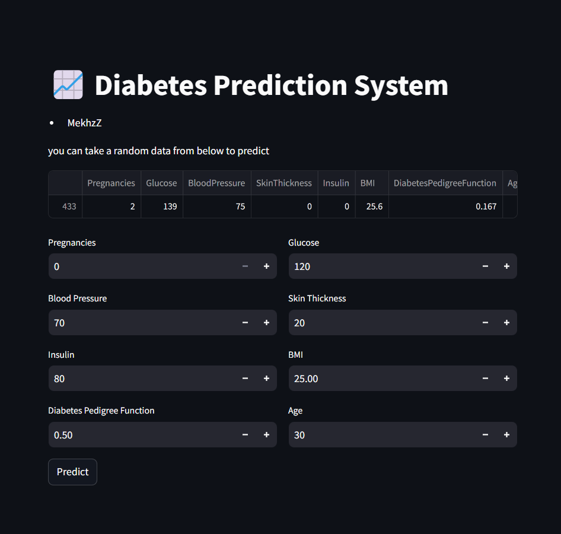

# Diabetes Prediction System using Streamlit

This project is a **Diabetes Prediction System** built using **Streamlit** for the web interface and a **custom-made SVM (Support Vector Machine)** classifier for prediction. The system allows users to input medical details and get a prediction about whether or not they may have diabetes, based on the provided data.

## Features
- **Custom SVM Classifier**: A Support Vector Machine model created from scratch using Python.
- **Interactive Web Application**: Deployed using Streamlit for easy and interactive user input.
- **Real-time Prediction**: Provides instant results based on the input medical data.

## Live Demo
You can access the live demo of the app here:

🔗 [Live Streamlit App](https://diabetespredictionsystemusingapp-gu98foprwnu8j6xmno7qyj.streamlit.app/)

## How to Run the Project Locally

1. Clone this repository:

   ```bash
   git clone https://github.com/MekhzZ/Diabetes_prediction_system_using_streamlit.git
   cd Diabetes_prediction_system_using_streamlit
   ```
2. Install the required dependencies:
   
   ```bash
   pip install -r requirements.txt
   ```
   
4. Run the streamlit app:

   ```bash
   streamlit run main.py
   ```

## More details

This project implements a custom SVM classifier built from scratch using Python. The classifier is trained on diabetes data to distinguish between diabetic and non-diabetic patients based on various features such as:

- Number of pregnancies
- Glucose level
- Blood pressure
- Skin thickness
- Insulin level
- BMI
- Age

You can find the code for the custom SVM classifier in my GitHub repository below:

🔗 [Custom SVM Classifier GitHub Repo](https://github.com/MekhzZ/SVM_Classifier_from_scratch)

## Files

- **main.py** : The main script for running the Streamlit app.
- **diabetes_trained_model.sav** : The trained model saved using pickle.
- **scaler.pkl**: The saved scaler for normalizing input data.
- **requirements.txt**: List of required dependencies for the project.

## Dataset

The diabetes dataset used for training the model can be found on [Kaggle](https://www.kaggle.com/datasets/akshaydattatraykhare/diabetes-dataset).

## Screenshots
Here is a screenshot of the Diabetes Prediction System in action:



